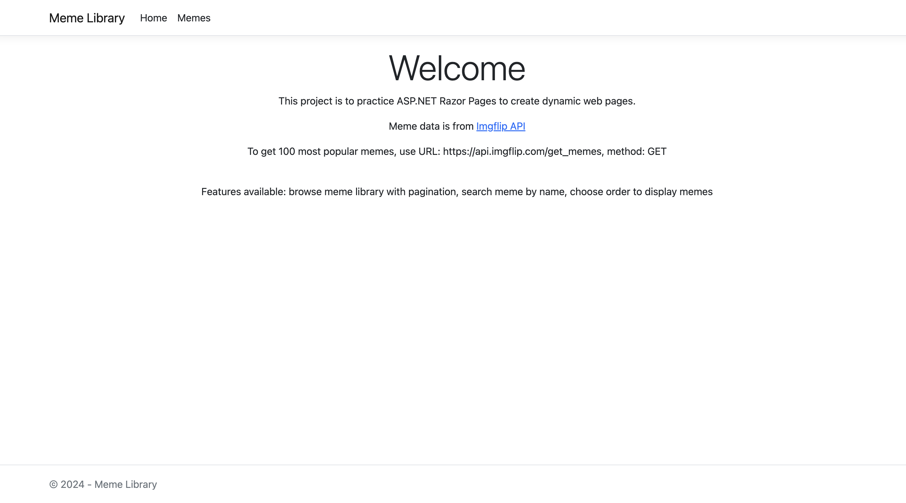
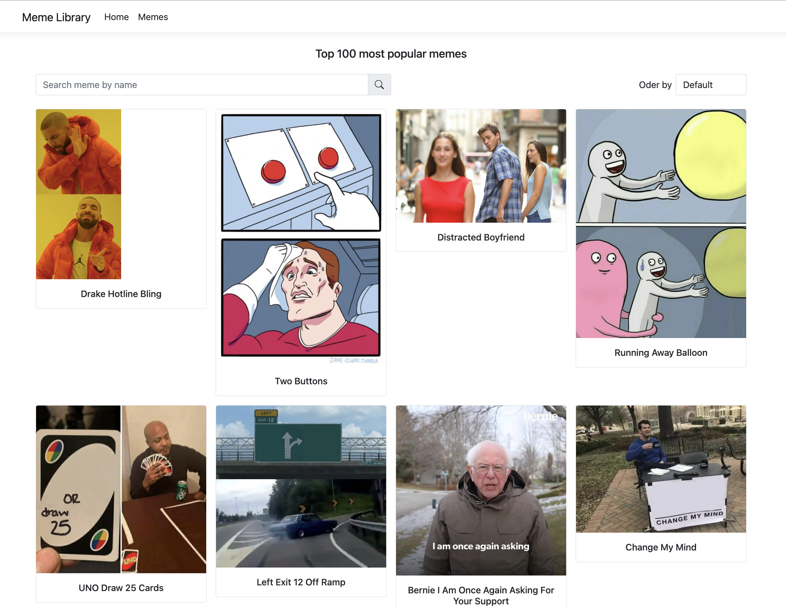
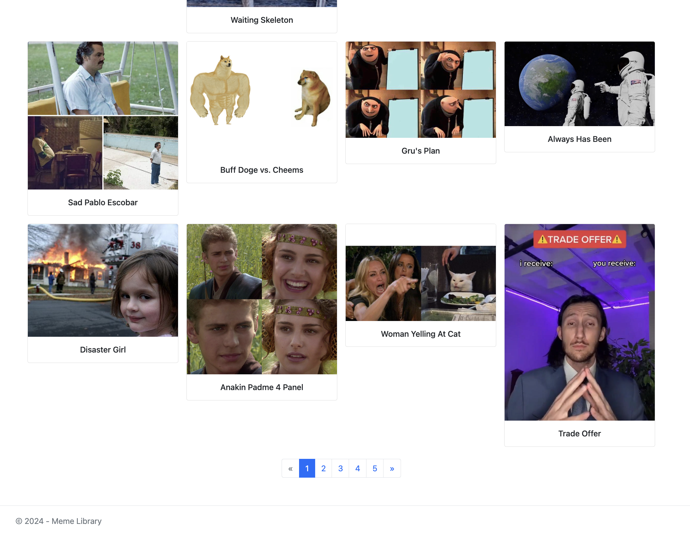

## Meme Library
This project is learn and practice ASP\.NET Razor Pages and Bootstrap to create simple frontend web pages
- Frontend: ASP\.NET Razor Pages, Bootstrap
- Backend: ASP\.NET Core, Entity Framework, PostgreSQL

#### Table of Contents
1. [Demo](#1-demo)
2. [Features](#2-features)
3. [Details](#3-details)
4. [Local run](#4-local-run)

#### 1. Demo
Homepage


Meme library

Pagination


#### 2. Features
##### Frontend
- Browse meme library with pagination
- Search meme by name
- Choose order to display memes (most popular, least popular, alphabetically)
#### Backend
- Swagger UI for API endpoints

#### 3. Details
##### Project Design
The project is built using C# and .NET framework. Project has 1 solution that includes frontend, backend and tests.

CLEAN architecture is used to build the project

([image source](https://blog.cleancoder.com/uncle-bob/2012/08/13/the-clean-architecture.html))

Below is project's main structure

Applying CLEAN architecture:
- **MemeLibrary.Domain** (Entities): is the inner most layer, where entities, Repo Interfaces are
- **MemeLibrary.Application** (Use Cases): is the next layer, where business/service interfaces and their implementations are
- **MemeLibrary.Infrastructure** & **MemeLibrary\.Web**: are the outer most layer
    - __MemeLibrary.Infrastructure__: contains Database & Repo implementation
    - __MemeLibrary\.Web__: contains web UI

#### Data & entities
Meme data is from [Imgflip API](https://imgflip.com/api)
URL: https://api.imgflip.com/get_memes
Method: GET
Example Success Response: 
```
{
  "success": true,
  "data": {
    "memes": [
      {
        "id": "181913649",
        "name": "Drake Hotline Bling",
        "url": "https://i.imgflip.com/30b1gx.jpg",
        "width": 1200,
        "height": 1200,
        "box_count": 2,
        "captions": 1177250
      },
      {
        "id": "87743020",
        "name": "Two Buttons",
        "url": "https://i.imgflip.com/1g8my4.jpg",
        "width": 600,
        "height": 908,
        "box_count": 3,
        "captions": 947750
      },
      <!-- 98 more -->
    ]
  }
}   
```
- *box_count*: is the default number of boxes each meme uses. some memes have many text boxes
- *captions*: I used this prop to measure a meme's popularity to set the order options


**_In this project, in order to practice EF Core & PostgreSQL, I built a local database & imported data from Imgflip API in Domain & Infrastructure layers, and interact with it through services in Application layer_**

#### 4. Local run
##### 4.1. Backend

**Connect to local database**
from root directory
```
dotnet restore
cd MemeLibrary.Infrastructure
```
Set up ConnectionStrings in appsettings.json or appsettings.Development.json, example:
```
"ConnectionStrings": {
   "DefaultConnection": "Host=localhost;Username=username;Password=password;Database=memedb;Port=5432;"
   }
```
then
```
dotnet ef migrations add Initial
dotnet ef database update
```

**Import data**
inside your local PostgreSQL server:
- import data manually using **Data > memedb.csv**
- or use script in **Data > importData.sql**
to import data into your table

**Open Swagger UI & interact with endpoints**
```
dotnet watch
```

##### 4.2. Frontend
from root directory
```
dotnet restore
cd MemeLibrary.Web
dotnet watch
```